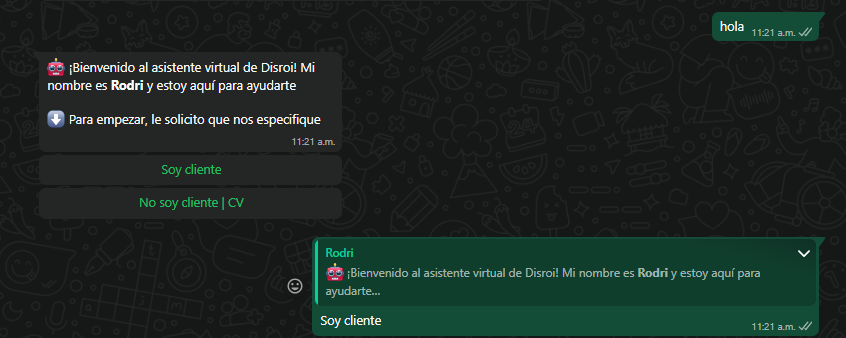

<div style="border:1px solid #cccccc3d; padding:8px; border-radius:4px;">
  <strong>Versión actual:</strong> 1.1.daa4f89 <br>
  📄 <a href="./CHANGELOG.md">Ver Changelog</a>
</div>

# "Rodri", chatbot de whatsapp y plataforma de reclamos



## Sistemas y programas necesarios

Para poder ejecutar este código es necesario _Git_, _Node_, _Express_, _Ngrok_, _Prisma_, acceso a un __dominio dedicado__ y un __número telefónico__ asociado a _Meta_

__Para este proyecto se utilizó la compatibilidad con meta que ofrece la plataforma _Twilio___

## Instalar git y Node
### Git (SCM para modelos de ramas)

- [Windows](https://git-scm.com/downloads/win)
- [Ubuntu](https://git-scm.com/downloads/linux)


### Node (Plataforma para entornos basados en Javascript)

- [Instalador](https://nodejs.org/en/download)

## Build

### Repositorio

`git clone https://github.com/RodrigoMari/Chatbot-whatsapp-Disroi`

`cd Chatbot-whatsapp-Disroi`

### .env

`type nul > .env`


Copiar en .env y rellenar las keys necesarias
```
DATABASE_URL=base_url

VAPID_PUBLIC_KEY=public_push_notifications_key
VAPID_PRIVATE_KEY=private_push_notifications_key

TWILIO_ACCOUNT_SID=twilio_account_sid
TWILIO_AUTH_TOKEN=twilio_secret_auth_token
```

### Dependencias

`npm install`

### Base de datos (ORM Prisma)

`npx prisma db push`

`npx prisma generate`

Para migraciones versionadas

`npx prisma migrate dev --name inicial`

`npx prisma generate`

### Correr el programa

`npm run dev`

## Requerimientos

El programa funciona con un webhook que hace referencia al número de telefono comprado y en producción. Además, es necesario que la página este levantada en el puerto 3443 con el uso de la aplicacion de **Ngrok** conectada a una cuenta de dicho servicio.

El backlog de reclamos, levantado en la página, será utilizado por gente dentro del dominio. El método de acceso esta pensado mediante las respectivas IPs públicas brindadas por la red, estas deberán ser llenadas en un listado llamado `allowedIPs` al comienzo del archivo **app.js**. 

Para el correcto funcionamiento del flujo seran necesario 2 tipos de usuario: el cliente que posee un reclamo y el empleado que lo resuelve. El cliente se contactará con **"Rodri"** de manera directa mediante **Whatsapp**, especificando su reclamo y todos los datos necesarios, acto seguido, el empleado será notificado y acudirá a la resolución del problema.

Cabe recalcar que puede haber mas de 1 empleado implicado en cada reclamo.